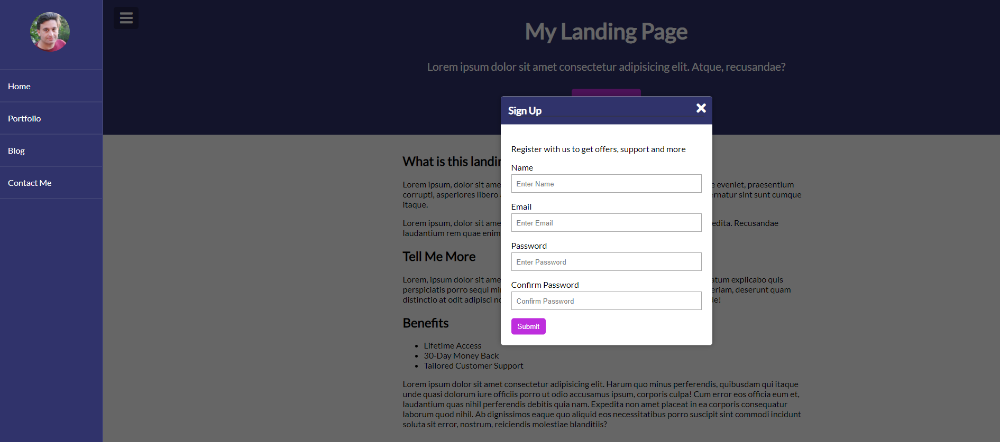

## Menu Slider & Modal

Created primarily with HTML and CSS with some vanilla JavaScript for the event listeners. Utilizes DOM manipulation. This is part of Brad Traversy's '20 Vanilla Projects' series.

